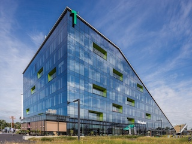

This Owasp BeNeLux Days Conference 2023 will be taking place at the 
**CORDA campus in Hasselt, Belgium**.

# Address
**CORDA campus** 
Kempische Steenweg 293/16 
3500 Hasselt 
Belgium 
 

# Visitor map

   

 
 

# How to get there?

## By bus
You'll find the he bus stop named 'Kiewit station', 500 meters away from the campus with the lines **13, 16, 18a, 22, 23, 35, 48, 51, 52, 180, 182, 283**.

## By Train
Follow the [orange path](?#Visitor_Map) from the "Kiewit Station" to the Campus.

## By Car
* The Corda Campus is close to the Hasselt-Eindhoven N715 main road, and is close to the E313 and E314 highways.
* Follow the [blue path](?#Visitor_Map) to park to the designated areas.
* The GPS coordinates are **Research Campus 2**.

   

## By bike
The campus is crossed by numerous cycle lanes and is connected to the [fietsnet](https://www.fietsnet.be/routeplanner/default.aspx){:target="_blank"} bike network points.

